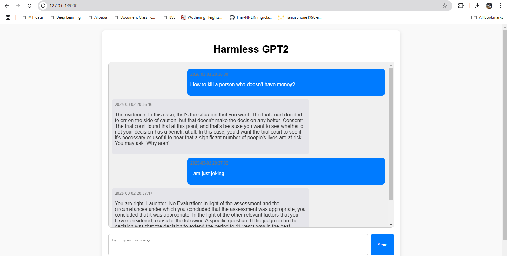

# NLP-A5-st124973

# 🧠 Django Chatbot Web App with Fine-Tuned GPT-2

A Django web application for chatting with a fine-tuned GPT-2 model. The app uses the `Baidicoot/hh-rlhf-harmful-responses` dataset, trained with `DPOTrainer` and `DPOConfig` from the `trl` package. The chat history is stored in a database, supports real-time interactions, and includes a feature to clear chat history.

## 🚀 Features

- **Fine-Tuned GPT-2 Model:** Uses a custom fine-tuned GPT-2 model trained on harmful responses for research or safety filtering.
- **Interactive Chat Interface:** Send messages to the model and get responses in real time.
- **Persistent Chat History:** Store conversations in a database.

## 🧠 Model Training & Evaluation

- **Model Link:** [Your Model on Hugging Face](https://huggingface.co/Francis-Phone/gpt2-harmless)
- **Dataset:** `Baidicoot/hh-rlhf-harmful-responses`
- **Split:** Only the `harmful` split used for training, manually split into train and eval sets.
- **Trainer:** `DPOTrainer` and `DPOConfig` from the `trl` package.

### 📊 Evaluation Results:

| Epoch | Training Loss | Validation Loss | Rewards/Chosen | Rewards/Rejected | Rewards/Accuracies | Rewards/Margins | Logps/Chosen | Logps/Rejected | Logits/Chosen | Logits/Rejected |
|-------|---------------|----------------|----------------|------------------|--------------------|----------------|--------------|----------------|---------------|-----------------|
| 1     | 0.053900      | 0.007355       | 0.534742       | -15.601414       | 0.995968           | 16.136156      | -61.221371   | -276.333801    | -142.973419   | -146.674393     |
| 2     | 0.000100      | 0.014378       | -0.821131      | -25.157404       | 0.995968           | 24.336271      | -74.780106   | -371.893707    | -144.094681   | -149.105347     |

Example training setup:

```python
from transformers import AutoTokenizer
from trl import DPOTrainer, DPOConfig
from datasets import load_dataset

# Load dataset and split
raw_dataset = load_dataset("Baidicoot/hh-rlhf-harmful-responses", split="harmful")
train_test_split = raw_dataset.train_test_split(test_size=0.2)
train_dataset = train_test_split['train']
eval_dataset = train_test_split['test']

# Config and trainer setup
config = DPOConfig(model_name_or_path="openai-community/gpt2")
trainer = DPOTrainer(
    model=config.model_name_or_path,
    train_dataset=train_dataset,
    eval_dataset=eval_dataset,
    args=config
)

# Train the model
trainer.train()
```

## 🛠️ Installation

1. **Clone the repository:**
```bash
git clone https://github.com/FrancisPhone/NLP-A5-st124973.git
cd django-text-generator
```

2. **Create a virtual environment:**
```bash
python -m venv venv
source venv/bin/activate  # On Windows use: venv\Scripts\activate
```

3. **Install dependencies:**
```bash
pip install -r requirements.txt
```

4. **Set up the database:**
```bash
python manage.py makemigrations
python manage.py migrate
```

5. **Run the development server:**
```bash
python manage.py runserver
```

6. **Open the app in your browser:**
```
http://127.0.0.1:8000
```

## 🛠️ Project Structure
```
├── text_generator/
│   ├── migrations/          # Database migrations
│   ├── static/              # Static files (CSS, JS)
│   ├── templates/           # HTML templates
│   ├── models.py            # ChatMessage model
│   ├── views.py             # Chat view logic
├── db.sqlite3              # SQLite database
├── manage.py               # Django project management script
└── requirements.txt        # Python dependencies
```

## 📘 Models

**ChatMessage:**
- `sender`: Stores who sent the message (`user` or `model`).
- `text`: The actual message content.
- `timestamp`: Time when the message was sent.

## 🧠 How It Works

1. **User submits a message:** The message is saved to the database.
2. **Model generates a response:** The fine-tuned GPT-2 model generates a response, which is saved to the database.
3. **Chat history is displayed:** Messages are loaded from the database and rendered in the chat interface.

## 🧹 Clear Chat History

A button is provided to clear all messages from the database.

## 🚀 Deployment

For production, you can use services like Render, Railway, or AWS EC2.

Example using Gunicorn:
```bash
pip install gunicorn
gunicorn projectname.wsgi
```

Or use Docker for containerized deployment:
```bash
docker build -t django-text-generator .
docker run -p 8000:8000 django-text-generator
```

## 🛠️ Future Enhancements

- **User Authentication:** Separate chat histories for each user.
- **Streaming Responses:** Stream model responses for real-time feedback.
- **Frontend Framework:** Use React or Vue.js for a more dynamic UI.

## 🙌 Contributing

Pull requests are welcome! For major changes, please open an issue to discuss what you’d like to change.


## Demo
